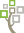
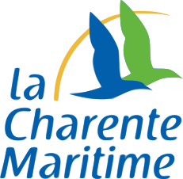

  
**GeneaGrab** is a tool to download images of digitised registers available on the websites of various (mainly French) archive services.

## Supported archive services

> For some services, UserScripts (🧰) are available to make GeneaGrab easier to use. To install them, you can use [Violentmonkey](https://violentmonkey.github.io/) or any other alternative.

### :earth_africa: Worldwide

* [ FamilySearch](https://www.familysearch.org) ([🧰](GeneaGrab.WebScripts/FamilySearch.user.js?raw=1))

### :fr: France

* [ Geneanet](https://www.geneanet.org/) ([🧰](GeneaGrab.WebScripts/Geneanet.user.js?raw=1))
* [ Archives Nice Côte d’Azur](https://archives.nicecotedazur.org/)
* [ Nice Historique](http://www.nicehistorique.org/)
* [ Archives départementales des Alpes-Maritimes](https://archives06.fr/) ([🧰](GeneaGrab.WebScripts/AD06.user.js?raw=1))
* [ Archives départementales de la Charente-Maritime](https://www.archinoe.net/v2/ad17/registre.html) ([🧰](GeneaGrab.WebScripts/AD17.user.js?raw=1))
* [ Archives départementales des Deux-Sèvres et de la Vienne](https://archives-deux-sevres-vienne.fr/)

### :it: Italy

* [ Antenati](https://www.antenati.san.beniculturali.it/) ([🧰](GeneaGrab.WebScripts/Antenati.user.js?raw=1))
