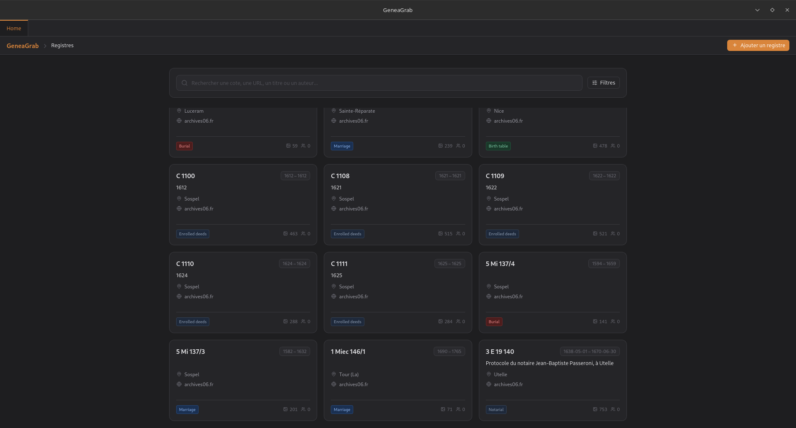
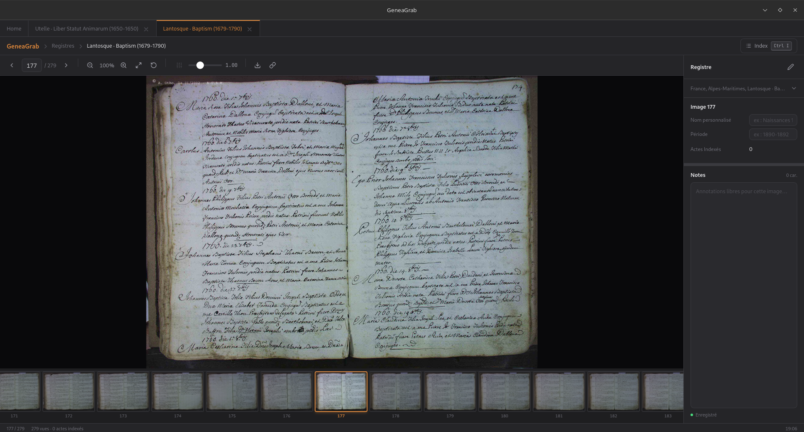

[](https://github.com/06Games/GeneaGrab/releases/latest)

**GeneaGrab** is a desktop tool to view and download images of digitised registers available on the websites of various (mainly French) archive services.

> [!NOTE]
> **GeneaGrab v4** is a complete rewrite using [Tauri v2](https://tauri.app/) (Rust backend & SolidJS frontend). Following this rewrite, providers are being re-implemented. Fewer providers are available currently, and some legacy providers may not return.

## Screenshots






## Supported Archive Services

UserScripts (🧰) are available for browser integration (via [Violentmonkey](https://violentmonkey.github.io/), Tampermonkey, etc.) to open records directly in GeneaGrab using custom protocol links (`geneagrab://`).

### Currently Supported (v4)

#### :fr: France

* **Archives départementales des Alpes-Maritimes (AD06)** — [archives06.fr](https://archives06.fr/) ([🧰 UserScript](userscripts/AD06.user.js))
* **Geneanet** — [geneanet.org](https://www.geneanet.org/) ([🧰 UserScript](userscripts/Geneanet.user.js))

### Legacy Archive Services (v1–v3)

> The following archive services were supported prior to the v4 Tauri rewrite. They are not currently supported in v4 while provider implementations are being reworked. Some may be re-added in future updates, while others may not return.

#### :earth_africa: Worldwide

* **FamilySearch** — [familysearch.org](https://www.familysearch.org) ([🧰 UserScript](userscripts/FamilySearch.user.js))

#### :fr: France

* **Archives départementales de la Charente-Maritime (AD17)** — [archinoe.net/v2/ad17](https://www.archinoe.net/v2/ad17/registre.html) ([🧰 UserScript](userscripts/AD17.user.js))
* **Archives Nice Côte d’Azur (AMNice)** — [archives.nicecotedazur.org](https://archives.nicecotedazur.org/)
* **Nice Historique** — [nicehistorique.org](http://www.nicehistorique.org/)
* **Archives départementales des Deux-Sèvres et de la Vienne (AD79-86)** — [archives-deux-sevres-vienne.fr](https://archives-deux-sevres-vienne.fr/)

#### :it: Italy

* **Antenati** — [antenati.san.beniculturali.it](https://www.antenati.san.beniculturali.it/) ([🧰 UserScript](userscripts/Antenati.user.js))

## Development

### Prerequisites

* [Rust](https://www.rust-lang.org/)
* [Bun](https://bun.sh/)
* Tauri CLI v2 (`cargo install tauri-cli --version "^2.0.0"`)

### Running locally

```bash
# Install dependencies
make install

# Start the desktop application in dev mode
make desktop_dev
```

